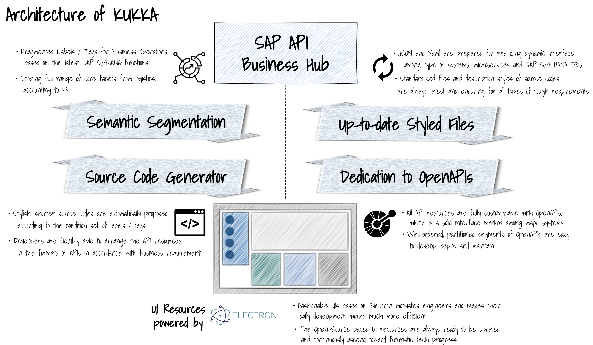

# kukka 

kukka は、SAP S/4HANA に対する 各 API の 命令様式に基づいて、API の命令文である SQL文 を自動生成・編集することができる、SAP-API開発者のためのツールです。    
kukka は、SAP S/4HANA の "HANA" にちなんで、フィンランド語の"花"から命名されました。  
kukka により、SAP S/4HANA の多岐複雑 な API ドキュメント の 理解にかかる時間と、開発ライフサイクルを短縮すうことができます。　　

## kukkaのアーキテクチャ
  

## kukkaの特徴  
### UI Resources powered by Electron  
UI は Electron をベースとしており、直感的で洗練されたUIとなっています。  
Electron は オープンソースのため、アップデートが容易であり、継続的に進歩します。  

### Semantic Segmentation  
SAP S/4HANAの機能をベースとした業務プロセス運用のための、ラベルやタグを活用できます。  
SAP S/4HANAのロジスティクスから会計、人事までの全範囲がカバーされています。   

### Source Code Generator  
ラベルやタグに合わせて、スタイリッシュで短いソースコードが自動的に生成、提案されます。
開発者は状況に応じて、APIフォーマットの中でフレキシブルにAPIリソースをアレンジできます。  

### Up-to-date, Styled Files  
JSONファイルやYamlファイルは、マイクロサービスやSAP S/4HANAのデータベース等のシステム間でインターフェースにより連携されます。  
標準化されたソースコードのファイル等は、常に最新の状態に保たれます。  

### Dedication to OpenAPIs
全てのAPIリソースは、OpenAPI仕様に自由にカスタマイズすることが可能です。  
OpenAPIのパーティション化により、開発、デプロイ、メンテナンスを容易に行うことができます。  

